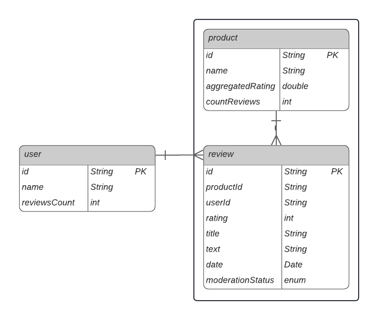

# Высоконагруженный сервис отзывов и рейтингов для е-cоmmerсе (Проект А5)

## Описание проекта

Сервис для сбора, хранения и анализа отзывов о товарах интернет-магазина.  
Проект ориентирован на **высокие нагрузки** во время акций и распродаж, когда тысячи пользователей одновременно читают и пишут отзывы.

### Технологический стек
- **Java**
- **Spring Boot**
- **MongoDB** — основное хранилище данных.
- **Hazelcast** — кэширование агрегированных данных и rate limiting.
- **OpenSearch** — полнотекстовый поиск и аналитика.
- **REST API** — взаимодействие с клиентами и сервисами.

# Схема данных

---

# Сценарии работы

## Сценарии для пользователей (User)

### 1. Регистрация пользователя

**API:** `POST /api/user`

### 2. Просмотр профиля пользователя

**API:** `GET /api/user/{userId}`

### 3. Удаление пользователя и его отзывов

**API:** `DELETE /api/user/{userId}`

---

## Сценарии для товаров (Product)

### 4. Добавление товара

**API:** `POST /api/product`

### 5. Удаление товара со всеми отзывами

**API:** `DELETE /api/product/{productId}`

### 6. Получение агрегированных данных по товару
Пока нет.

**API:** `GET /api/product/{productId}/summary`

---

## Сценарии для отзывов (Review)
Пока что реализован аналогично предыдущим, нет зависимостей.

### 7. Добавление нового отзыва

**API:** `POST /api/product/{productId}/review`

### 8. Получение отзывов с фильтрацией

**API:** `GET /api/product/{productId}/review`

### 9. Модерация отзывов

**API:** `POST /api/review/{reviewId}/moderate`

### 10. Удаление отзыва

**API:**
- Пользователь: `DELETE /api/product/{productId}/review/{reviewId}`
- Администратор: `DELETE /api/review/{reviewId}`
